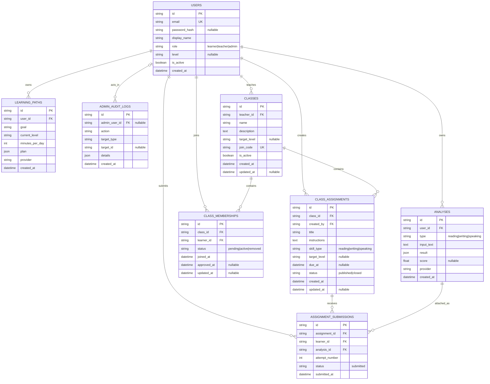

# Architecture

## Product boundary

LearnMate AI gives formative feedback for Vietnamese English learners. It is not an accredited language examination. Speaking is intentionally split into:

1. STT transcript evaluation: relevance, grammar and vocabulary.
2. Future pronunciation assessment: short target-word audio compared at phoneme level.

STT text is never presented as evidence of pronunciation accuracy.

## Components

| Component | Technology | Responsibility |
|---|---|---|
| Mobile | Flutter 3.41 / Dart 3.11 | Auth, camera, OCR, microphone, learning UI |
| Management web | React 19 / Next-compatible vinext | Teacher classrooms plus administrator operations, moderation and API Console |
| OCR | ML Kit Text Recognition | Latin text extraction on Android/iOS |
| STT | Device speech recognition | English transcript capture |
| API | FastAPI / Python 3.14 | Auth, validation, AI orchestration, classrooms, learning paths, history |
| ORM/migrations | SQLAlchemy / Alembic | Relational persistence and versioned schema |
| Database | SQLite dev, PostgreSQL prod | Users, analyses, learning paths, classrooms, assignments, submissions and audit records |
| AI | Mock or Gemini | Structured formative feedback |
| Delivery | Docker / Cloudflare Worker / GitHub Actions / GHCR | Test, package, release and deploy mobile/API/admin |

## Main sequence

```text
Learner -> Flutter: camera image
Flutter -> ML Kit: recognize locally
ML Kit -> Flutter: extracted text
Learner -> Flutter: review/edit text
Flutter -> API: Bearer token + text
API -> AI provider: prompt + JSON schema
AI provider -> API: structured result
API -> Database: persist analysis for user
API -> Flutter: result
```

Learning-path flow:

```text
Learner -> Flutter: goal + CEFR level + minutes per day
Flutter -> API: authenticated generation request
API -> Database: summarize up to 20 recent analyses
API -> Mock/Gemini: summary + fixed seven-day JSON schema
API -> Database: validate and persist learner-owned path
API -> Flutter: focus areas, seven tasks and measurable checkpoints
```

Administrator flow:

```text
Admin -> Web: email/password
Web -> API: login
API -> Web: JWT + server-validated admin role
Web -> API: Bearer token + administration request
API -> Database: enforce RBAC, mutate/query, append audit record
API -> Web: operational data or structured API Console response
```

Classroom flow:

```text
Teacher -> Web -> API: create owned class and assignment
API -> Database: persist class and rotatable join code
Learner -> Flutter -> API: request membership with join code
Teacher -> Web -> API: approve learner
Learner -> Flutter -> API: submit an owned, type-compatible analysis
API -> Database: link assignment, learner and analysis as a submission
Teacher -> Web -> API: read only analyses explicitly submitted to that class
```

## Database

Current relational ERD (table names match the migration schema):



`class_memberships` is unique on `(class_id, learner_id)`, while
`assignment_submissions` is unique on `(assignment_id, learner_id,
attempt_number)`.

### users

`id`, `email`, `password_hash`, `display_name`, `role`, `level`, `is_active`, `created_at`, `updated_at`, `last_login_at`

### analyses

`id`, `user_id`, `type`, `input_text`, `result`, `score`, `provider`, `created_at`

`analyses.user_id` is a cascading foreign key. Queries always include the authenticated user ID. AI-specific output remains JSON for MVP flexibility but is validated before persistence.

### admin_audit_logs

`id`, `admin_user_id`, `action`, `target_type`, `target_id`, `details`, `created_at`

Administrative authorization is enforced by the API. The dashboard is only a client and cannot grant itself access. Audit entries record state changes and moderation actions while excluding passwords, tokens and full learner submissions.

### learning_paths

`id`, `user_id`, `goal`, `current_level`, `minutes_per_day`, `plan`, `provider`, `created_at`

`learning_paths.user_id` cascades on user deletion. The JSON plan is schema-validated before persistence and always contains seven daily tasks. Personalization is derived from aggregate counts, scores and issue titles rather than sending full historical submissions to the provider.

### classes and class_memberships

`classes` stores the owning `teacher_id`, class metadata, optional CEFR target,
active state and unique rotatable join code. `class_memberships` implements the
learner-to-class many-to-many relationship with `pending`, `active` and
`removed` states plus a unique `(class_id, learner_id)` constraint.

### class_assignments and assignment_submissions

Assignments belong to one class and declare a reading, writing or speaking
skill. A submission links an active class member to an existing learner-owned
analysis of the same skill and records an attempt number. The analysis foreign
key is restrictive so submitted class work cannot silently disappear. Assignment
content, deadline and `published`/`closed` lifecycle remain editable, while the
skill is immutable so existing submission types cannot be reinterpreted.

## Security boundaries

- Passwords use Argon2 through `pwdlib`.
- JWTs expire and contain only the user ID.
- Tokens are stored with Flutter secure storage.
- Teacher/admin web JWTs are tab-scoped in browser `sessionStorage`, not persistent local storage.
- Gemini keys remain server-side and are ignored by Git.
- Development identity headers are disabled in production.
- Administrator endpoints require an active server-validated `admin` role.
- Teacher routes require an active server-validated `teacher` role and class ownership; administrators may moderate all classes.
- Active class ownership prevents disabling or demoting a teacher; classes must be paused first, and can be reopened only after the owner is an active teacher again.
- Class membership never grants access to a learner's private analysis history. Teachers receive only analyses linked through assignment submissions.
- The final active administrator and the current administrator session are protected from accidental lockout.
- Production settings reject weak JWT secrets.
- Release signing keys are GitHub secrets, never repository files.

## Known production boundaries

- Add rate limiting through an API gateway or Redis-backed limiter before public launch.
- Add password reset/email verification before public registration.
- Add observability and personal-data retention rules.
- Validate pronunciation with a dedicated acoustic/phoneme pipeline, not an LLM transcript score.
