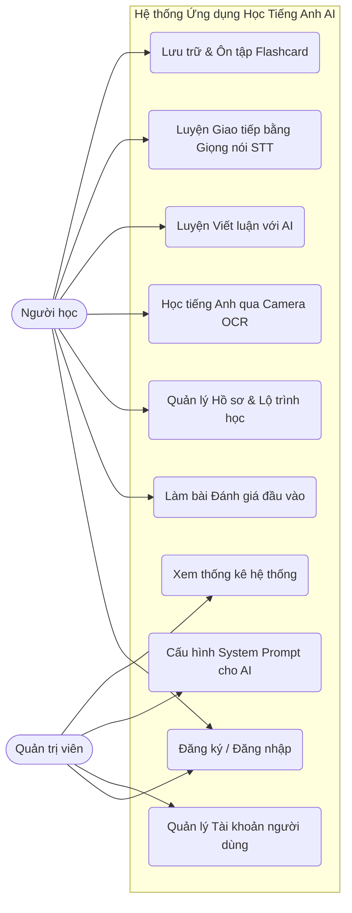
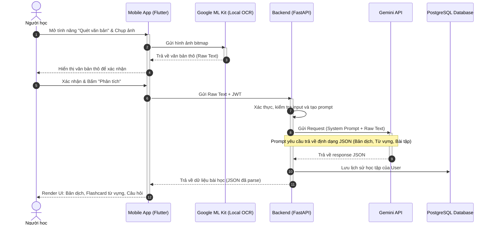

1. Tên đề tài
Nghiên cứu và xây dựng ứng dụng di động hỗ trợ học tiếng Anh thông minh tích hợp trí tuệ nhân tạo (LLM và OCR)

2. Đặt vấn đề và Lý do chọn đề tài
Vấn đề: Người tự học tiếng Anh hiện nay thiếu môi trường thực hành và không có người chấm chữa lỗi sai tức thời (đặc biệt ở kỹ năng Viết và Nói).

Giải pháp: Ứng dụng đóng vai trò như một "Gia sư AI 24/7", tận dụng sức mạnh của Large Language Models (LLM) để chấm điểm, nhận xét cá nhân hóa và công nghệ nhận dạng ký tự (OCR) để biến mọi văn bản trong đời thực thành bài học.

3. Phân quyền và Chức năng hệ thống (System Roles & Features)
Hệ thống sẽ được chia thành 2 quyền (Roles) chính để đảm bảo tính khả thi trong 3 tháng:

3.1. Quyền Người học (User/Learner) - Trọng tâm của App
Đây là đối tượng tương tác chính trên Mobile App.

Module 1: Xác thực & Hồ sơ (Authentication & Profile)

Đăng ký/Đăng nhập (Email, Google).

Làm bài Test đầu vào (Placement Test) để AI xác định trình độ và tạo lộ trình học (Personalized Roadmap).

Module 2: Trợ lý học tập qua Camera (OCR + LLM Core)

Chụp ảnh văn bản thực tế (sách, biển báo, menu, email).

Hệ thống dùng OCR bóc tách đoạn text -> LLM dịch nghĩa, phân tích cấu trúc ngữ pháp, trích xuất từ vựng khó và tự động tạo bài tập điền từ/trắc nghiệm từ đoạn văn đó.

Module 3: Luyện Viết (Writing Assistant)

Người dùng nhập đoạn văn/bài luận tiếng Anh.

AI sẽ: (1) Chỉ ra lỗi sai ngữ pháp, (2) Giải thích lý do sai, (3) Gợi ý cách viết lại (Rephrase) cho tự nhiên hơn, (4) Chấm điểm theo thang điểm chuẩn.

Module 4: Luyện Nói (Speaking Assistant - STT + LLM)

Người dùng đọc một đoạn văn hoặc trả lời câu hỏi bằng giọng nói.

Chuyển đổi Giọng nói thành Văn bản (Speech-to-Text). AI đối chiếu văn bản đó để đánh giá từ vựng, độ trôi chảy và gợi ý câu trả lời hay hơn.

3.2. Quyền Quản trị viên (Admin)
Quản trị qua một Web Dashboard đơn giản hoặc trực tiếp trên Console của Firebase/Database.

Quản lý người dùng: Xem số lượng tài khoản, trạng thái hoạt động.

Quản lý Prompt & API (Rất quan trọng): Giám sát chi phí gọi API LLM, tinh chỉnh các "System Prompt" (Câu lệnh gốc cấu hình cho AI để AI đóng vai một giáo viên tiếng Anh nghiêm khắc hoặc thân thiện).

Thống kê: Xem biểu đồ mức độ tiến bộ chung của người dùng.

4. Kiến trúc Hệ thống & Công nghệ sử dụng
Để hoàn thành trong 3 tháng, cần chọn Stack công nghệ tối ưu tốc độ và hiệu năng:

Front-end (Mobile App): Flutter (Dart) - Giúp build cả iOS/Android với UI mượt mà, nhiều thư viện hỗ trợ camera và audio.

Back-end & Cơ sở dữ liệu:

Phương án tối ưu: Firebase (Authentix`cation, Firestore Database, Cloud Storage).

Bảo mật API: Viết các Cloud Functions (Node.js) để gọi API của LLM. (Tuyệt đối không nhúng trực tiếp API Key của OpenAI/Gemini vào Flutter app để tránh bị đánh cắp tài nguyên).

Công nghệ AI & ML:

LLM (Chấm điểm & Xử lý ngôn ngữ): Google Gemini API (Tốc độ phản hồi cực nhanh, chi phí rẻ/miễn phí cho sinh viên) hoặc OpenAI API (GPT-4o-mini).

OCR (Nhận diện hình ảnh): Google ML Kit (Vision API) - Xử lý trực tiếp trên thiết bị (On-device) giúp phản hồi tức thì, không tốn phí server.

STT (Nhận diện giọng nói): Google Speech-to-Text hoặc thư viện có sẵn của thiết bị.

5. Kế hoạch và Quy trình thực hiện (Timeline 3 Tháng / 12 Tuần)
Áp dụng mô hình Agile/Scrum thu gọn, chia làm 3 giai đoạn (Sprints lớn):

Tháng 1: Phân tích, Thiết kế & Xây dựng nền tảng (Tuần 1 - 4)

Tuần 1-2: Khảo sát các app hiện có (Duolingo, Elsa, Grammarly). Chốt yêu cầu chức năng.

Tuần 3: Thiết kế UI/UX trên Figma (vẽ luồng màn hình). Thiết kế cấu trúc Database.

Tuần 4: Khởi tạo project Flutter, setup Firebase, thiết kế màn hình Login, Home.

Tháng 2: Tích hợp công nghệ cốt lõi - AI & OCR (Tuần 5 - 8)

Tuần 5: Tích hợp Google ML Kit (OCR) - Hoàn thiện chức năng chụp ảnh và trích xuất chữ.

Tuần 6: Xây dựng Backend (Cloud Functions) và tích hợp API LLM. Viết "System Prompts" chuẩn cho giáo viên AI.

Tuần 7: Nối API vào Mobile App - Hoàn thiện tính năng Chấm điểm Viết và Đọc hiểu.

Tuần 8: Xử lý ghi âm (Audio) và tích hợp tính năng Luyện Nói.

Tháng 3: Kiểm thử, Tối ưu & Viết báo cáo (Tuần 9 - 12)

Tuần 9: Hoàn thiện tính năng thống kê, lộ trình học cá nhân.

Tuần 10: Kiểm thử toàn hệ thống (Test cases, bắt bug UI/UX, tối ưu thời gian chờ của AI).

Tuần 11: Viết tài liệu báo cáo Đồ án (Quy trình, Use Case, Sequence Diagram).

Tuần 12: Đóng gói ứng dụng (File APK/IPA), làm slide thuyết trình và luyện tập bảo vệ đồ án.

6. Kết quả dự kiến đạt được
Về lý thuyết: Nghiên cứu thành công phương pháp tích hợp LLM và OCR vào ứng dụng di động; cách thiết kế "Prompt Engineering" hiệu quả cho giáo dục.

Về thực hành: Sản phẩm là một ứng dụng di động chạy thực tế (file cài đặt APK), hoạt động ổn định, demo mượt mà các luồng xử lý AI.

Báo cáo: Cuốn báo cáo đồ án đúng quy chuẩn học thuật của nhà trường.

💡 Lời khuyên thêm cho bạn:

Với thời gian 3 tháng, nếu thầy/cô hỏi: "Đề tài này có quá sức không?". Bạn hãy tự tin trả lời: "Em áp dụng mô hình MVP (Minimum Viable Product). Em sẽ không làm các tính năng rườm rà như mạng xã hội hay nạp thẻ, mà tập trung 100% vào luồng lõi là: Input (Camera/Mic/Text) -> Backend AI xử lý -> Output (Chấm điểm/Gợi ý). Với Google ML Kit (chạy offline) và Firebase, em hoàn toàn kiểm soát được tiến độ trong 12 tuần".

Bạn copy phần 1 đến phần 6 gửi cho Giảng viên nhé. Nếu cần vẽ thêm biểu đồ (Use Case, Flowchart) để chèn vào file Word, cứ báo mình!

# CHƯƠNG: PHÂN TÍCH VÀ THIẾT KẾ HỆ THỐNG

## 1. SƠ ĐỒ USE CASE (USE CASE DIAGRAM) TỔNG QUÁT

Sơ đồ Use Case thể hiện sự tương tác giữa các tác nhân (Actors) và các chức năng của hệ thống. Hệ thống có 2 tác nhân chính: **Người học** (Sử dụng Mobile App) và **Quản trị viên** (Sử dụng Web Dashboard / Database Console).

*(Bạn hãy copy đoạn code bên dưới dán vào trang **https://mermaid.live** để lấy ảnh sơ đồ)*

## 2. ĐẶC TẢ CHI TIẾT CÁC LUỒNG TÍNH NĂNG (FEATURE FLOWS)

### 2.1. Phân quyền: NGƯỜI HỌC (LEARNER ROLE)
Luồng 1: Xác thực và Cá nhân hóa lộ trình (Onboarding Flow)

Mở ứng dụng -> Màn hình Splash Screen.

Chọn "Đăng nhập" (nếu đã có tài khoản) hoặc "Đăng ký" (Email/Mật khẩu hoặc qua Google).

Lần đầu đăng nhập: Hệ thống yêu cầu làm một bài trắc nghiệm ngắn (Placement Test) từ 5-10 câu.

App gửi kết quả bài test lên Backend. AI đánh giá và tạo ra một Lộ trình học cá nhân hóa (Trình độ hiện tại, mục tiêu, các chủ đề cần học).

Điều hướng vào màn hình Trang chủ (Home).

Luồng 2: Trợ lý học tập qua Camera (OCR + LLM Flow) - Tính năng đinh

Tại Trang chủ, chọn tính năng "Quét văn bản".

Hệ thống gọi API Camera của thiết bị -> Người dùng chụp ảnh một đoạn văn (sách, biển báo...).

Ứng dụng sử dụng Google ML Kit (On-device OCR) để bóc tách chữ từ ảnh thành văn bản thô (Raw Text).

Người dùng xác nhận hoặc chỉnh sửa văn bản thô nếu OCR nhận diện sai vài chỗ.

Bấm "Phân tích bằng AI". App gửi Text này qua Cloud Functions (Backend).

Backend đính kèm Text vào một câu lệnh (Prompt) đã cấu hình sẵn gửi đến LLM (Gemini/OpenAI): "Hãy đóng vai giáo viên, dịch đoạn văn sau, giải thích các cấu trúc ngữ pháp khó, trích xuất 5 từ vựng quan trọng và tạo 3 câu hỏi trắc nghiệm kiểm tra đọc hiểu".

LLM trả về dữ liệu định dạng JSON. Backend trả JSON về Mobile App.

Mobile App hiển thị kết quả (Bản dịch, Từ vựng, Bài tập). Người dùng có thể bấm "Lưu từ vựng" vào Flashcard.

Luồng 3: Luyện Viết luận (Writing Assistant Flow)

Chọn tính năng "Luyện Viết".

Chọn chủ đề (được AI gợi ý) hoặc tự chọn chủ đề tự do (IELTS Task 2, Email công việc...).

Giao diện soạn thảo hiện ra -> Người dùng nhập/paste đoạn văn bản.

Bấm "Chấm bài". Text được gửi lên Backend -> LLM.

LLM phân tích và trả về: Điểm số (ví dụ 6.0 IELTS), danh sách lỗi sai (bôi đỏ), giải thích lỗi, và một đoạn văn mẫu đã được viết lại cho tự nhiên (Rephrased).

App render kết quả trực quan cho người dùng.

Luồng 4: Luyện Nói và Phát âm (Speaking Assistant Flow)

Chọn tính năng "Luyện Nói".

App hiển thị một câu hỏi giao tiếp. Người dùng nhấn giữ nút Microphone để trả lời.

Sử dụng công nghệ Speech-to-Text (STT) để chuyển âm thanh thu được thành văn bản ngay trên màn hình.

Bấm "Đánh giá". Đoạn text vừa chuyển đổi được gửi cho LLM.

LLM đánh giá tiêu chí: Mức độ trả lời đúng trọng tâm, độ đa dạng từ vựng, và gợi ý cách trả lời hay hơn.

2.2. Phân quyền: QUẢN TRỊ VIÊN (ADMIN ROLE)
(Lưu ý: Để tiết kiệm thời gian 3 tháng, phần Admin có thể không cần viết App riêng mà thiết kế một Web nội bộ đơn giản bằng React/Vue hoặc thao tác thẳng trên Firebase Console + CMS tự code).

Luồng 1: Quản lý System Prompt (Prompt Engineering)
Đây là trái tim của hệ thống AI. Admin sẽ định hình AI ứng xử như thế nào.

Admin đăng nhập vào Dashboard.

Mở mục "Cấu hình AI Prompt".

Thấy danh sách các Prompt đang dùng (Ví dụ: Prompt_Chấm_Viết, Prompt_Tạo_Bài_Tập_Từ_Ảnh).

Admin có thể sửa nội dung Prompt (VD: Thêm câu lệnh "Hãy giải thích bằng giọng điệu vui vẻ, dùng nhiều emoji").

Lưu lại. Lần sau User trên App sử dụng tính năng, Backend sẽ lấy Prompt mới nhất này để gọi API AI.

Luồng 2: Quản lý người dùng

Admin xem danh sách User (Email, ngày tạo, trình độ hiện tại, số lượt gọi AI).

Khóa (Ban) tài khoản nếu phát hiện lạm dụng/spam.

3. SƠ ĐỒ TUẦN TỰ (SEQUENCE DIAGRAM) CỦA TÍNH NĂNG CỐT LÕI
Dưới đây là sơ đồ tuần tự mô tả kỹ thuật luồng tính năng phức tạp và "ăn tiền" nhất của đồ án: Chụp ảnh văn bản -> OCR -> LLM AI -> Trả kết quả học tập.

(Tiếp tục copy đoạn code bên dưới dán vào trang https://mermaid.live để lấy ảnh sơ đồ)

Bạn có thể dùng ngay nội dung trong file trên để cho vào chương **Phân tích thiết kế** của Đồ án.

**Mẹo nhỏ khi làm phần này:** 
Việc tách phần gọi API của LLM (Gemini/OpenAI) ra một **Backend (Cloud Functions)** thay vì gọi trực tiếp từ code Flutter (Mobile App) như trong sơ đồ Sequence ở trên là một điểm **cộng rất lớn** về kiến trúc phần mềm (Architecture). Nếu bị hội đồng hỏi, bạn hãy giải thích rằng làm như vậy là để **bảo mật API Key** (không bị dịch ngược app để lấy cắp), đồng thời Admin có thể sửa đổi Prompt một cách tập trung ở Backend mà không cần phải bắt người dùng cập nhật lại App trên Store. 

Bạn xem luồng này đã đủ "xịn" để thuyết phục giảng viên chưa? Cần mình hỗ trợ thêm thiết kế Database Schema (Các bảng cơ sở dữ liệu) không?
